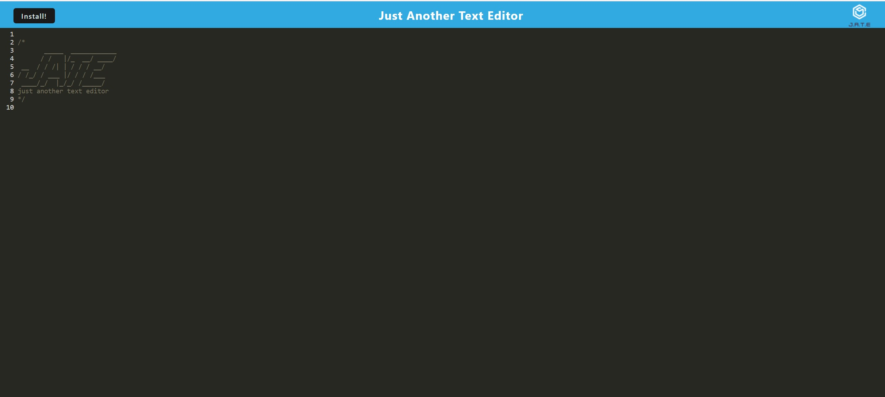

# PWA-J-A-T-E
Progressive Web Applications (PWA) -- Text Editor


## Badges
  [](https://opensource.org/licenses/MIT)


## Table of Contents
  * [License](#license)
  * [Description](#description)
  * [User Story](#user-story)
  * [Acceptance Criteria](#user-story)
  * [Usage](#usage)
  * [Screenshots of Application in Use](#screenshots-of-application-in-use)
  * [Technologies](#technologies)
  * [Questions?](#questions)


## License
  Read more about MIT here:
  [MIT](https://opensource.org/licenses/MIT)


## Description
A text editor that meets the PWA criteria and feature a number of data persistence techniques that serve as redundancy in case of the options is not supported by the browser. The application will also function offline.


## User Story
```
AS A developer
I WANT to create notes or code snippets with or without an internet connection
SO THAT I can reliably retrieve them for later use
```


## Acceptance Criteria 
```
GIVEN a text editor web application
WHEN I open my application in my editor
THEN I should see a client server folder structure
WHEN I run `npm run start` from the root directory
THEN I find that my application should start up the backend and serve the client
WHEN I run the text editor application from my terminal
THEN I find that my JavaScript files have been bundled using webpack
WHEN I run my webpack plugins
THEN I find that I have a generated HTML file, service worker, and a manifest file
WHEN I use next-gen JavaScript in my application
THEN I find that the text editor still functions in the browser without errors
WHEN I open the text editor
THEN I find that IndexedDB has immediately created a database storage
WHEN I enter content and subsequently click off of the DOM window
THEN I find that the content in the text editor has been saved with IndexedDB
WHEN I reopen the text editor after closing it
THEN I find that the content in the text editor has been retrieved from our IndexedDB
WHEN I click on the Install button
THEN I download my web application as an icon on my desktop
WHEN I load my web application
THEN I should have a registered service worker using workbox
WHEN I register a service worker
THEN I should have my static assets pre cached upon loading along with subsequent pages and static assets
WHEN I deploy to Heroku
THEN I should have proper build scripts for a webpack application
```         
        
## Usage
To use the application

- Step 1: After cloning this respitory, open the root directory of the repository in your terminal or bash.
- Step 2: Install npm packages by entering ```npm i``` in the command line.
- Step 3: Bundle and build the project code by entering ```npm run build``` in the command line
- Step 4: Start the server by entering ```npm run start``` in the command line.
- step 5: Go to the port on your local host in Google Chrome.
- step 6: Click the "Install" button.
- step 7: Alternatively, to use the live application, click [here](https://pwa-my-j-a-t-e.herokuapp.com/).


## Screenshots of of deployed App and Application in Use


[Deployed Site] (https://pwa-my-j-a-t-e.herokuapp.com/)

The following animation demonstrates the application functionality:


The following image shows the application's manifest.json file:


The following image shows the application's registered service worker:


The following image shows the application's IndexedDB storage:


## Technologies
* [Node.js](https://nodejs.org/en/)
* [Express.js](https://expressjs.com)
* [Heroku](https://www.heroku.com)
* [Babel](https://babeljs.io)
* [Javascript](https://developer.mozilla.org/en-US/docs/Web/JavaScript)
* [IndexedDB](https://developer.mozilla.org/en-US/docs/Web/API/IndexedDB_API)
* [Webpack & WebpackPwaManifest Plugins](https://www.npmjs.com/package/webpack-pwa-manifest)  


  ## Questions?
  ### Reach me here: 
  [ReginaldPrince](https://github.com/Reggiejr44)  
  Regprince788@gmail.com